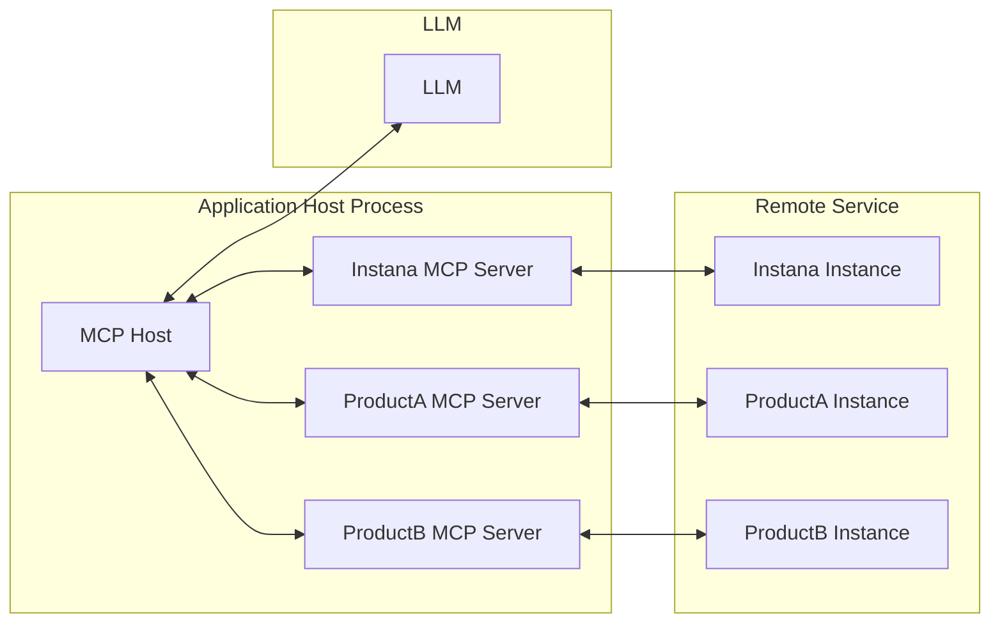
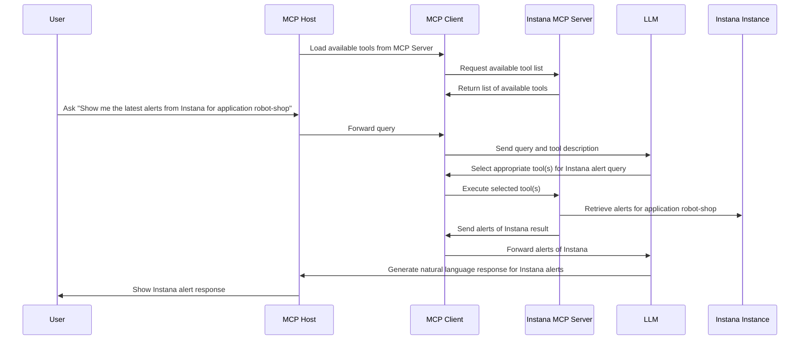

<!-- START doctoc generated TOC please keep comment here to allow auto update -->
<!-- DON'T EDIT THIS SECTION, INSTEAD RE-RUN doctoc TO UPDATE -->
## Table of Contents

- [MCP Server for IBM Instana](#mcp-server-for-ibm-instana)
  - [Quick Links](#-quick-links)
  - [Architecture Overview](#architecture-overview)
  - [Workflow](#workflow)
  - [Prerequisites](#prerequisites)
    - [Option 1: Install from PyPI (Recommended)](#option-1-install-from-pypi-recommended)
    - [Option 2: Development Installation](#option-2-development-installation)
      - [Installing uv](#installing-uv)
      - [Setting Up the Environment](#setting-up-the-environment)
    - [Header-Based Authentication for Streamable HTTP Mode](#header-based-authentication-for-streamable-http-mode)
      - [1. API Token Authentication (Direct API Calls)](#1-api-token-authentication-direct-api-calls)
      - [2. Session Token Authentication (UI-Initiated Calls)](#2-session-token-authentication-ui-initiated-calls)
      - [3. JWT Token Authentication (IBM Platform Integration)](#3-jwt-token-authentication-ibm-platform-integration)
  - [Starting the Local MCP Server](#starting-the-local-mcp-server)
    - [Server Command Options](#server-command-options)
      - [Using the CLI (PyPI Installation)](#using-the-cli-pypi-installation)
      - [Using Development Installation](#using-development-installation)
    - [Starting in Streamable HTTP Mode](#starting-in-streamable-http-mode)
      - [Using CLI (PyPI Installation)](#using-cli-pypi-installation)
      - [Using Development Installation](#using-development-installation-1)
    - [Starting in Stdio Mode](#starting-in-stdio-mode)
      - [Using CLI (PyPI Installation)](#using-cli-pypi-installation-1)
      - [Using Development Installation](#using-development-installation-2)
    - [Tool Categories](#tool-categories)
      - [Using CLI (PyPI Installation)](#using-cli-pypi-installation-2)
      - [Using Development Installation](#using-development-installation-3)
    - [SSL Certificate Verification](#ssl-certificate-verification)
      - [Using the CLI option](#using-the-cli-option)
      - [Using the environment variable](#using-the-environment-variable)
      - [Using a custom CA bundle](#using-a-custom-ca-bundle)
    - [Verifying Server Status](#verifying-server-status)
    - [Common Startup Issues](#common-startup-issues)
  - [Setup and Usage](#setup-and-usage)
    - [Supported MCP Clients](#supported-mcp-clients)
    - [Connecting to Multiple Instana MCP servers](#connecting-to-multiple-instana-mcp-servers)
  - [Connecting to Multiple Instana MCP Servers](#connecting-to-multiple-instana-mcp-servers)
  - [Supported Features](#supported-features)
  - [Available Tools](#available-tools)
  - [Tool Filtering](#tool-filtering)
    - [Available Tool Categories](#available-tool-categories)
    - [Usage Examples](#usage-examples)
      - [Using CLI (PyPI Installation)](#using-cli-pypi-installation-3)
      - [Using Development Installation](#using-development-installation-4)
    - [Benefits of Tool Filtering](#benefits-of-tool-filtering)
  - [Docker Deployment](#docker-deployment)
    - [Docker Architecture](#docker-architecture)
      - [**pyproject.toml**](#pyprojecttoml)
    - [Building the Docker Image](#building-the-docker-image)
      - [**Prerequisites**](#prerequisites-1)
      - [**Build and Run**](#build-and-run)
      - [**Run Command**](#run-command)
  - [Troubleshooting](#troubleshooting)
    - [**Docker Issues**](#docker-issues)
      - [**Container Won't Start**](#container-wont-start)
      - [**Connection Issues**](#connection-issues)
      - [**Performance Issues**](#performance-issues)
    - [**General Issues**](#general-issues)

<!-- END doctoc generated TOC please keep comment here to allow auto update -->

# MCP Server for IBM Instana

## Quick Links

- **[Tools & Examples](docs/TOOLS_AND_EXAMPLES.md)** - Comprehensive tool documentation with real-world examples
- **[Privacy Policy](docs/PRIVACY.md)** - Data handling and privacy information
- **[Docker Deployment Guide](DOCKER.md)** - Comprehensive Docker deployment, multi-architecture builds, and production setup

---

The Instana MCP server enables seamless interaction with the Instana observability platform, allowing you to access real-time observability data directly within your development workflow.

It serves as a bridge between clients (such as AI agents or custom tools) and the Instana REST APIs, converting user queries into Instana API requests and formatting the responses into structured, easily consumable formats.

The server supports both **Streamable HTTP** and **Stdio** transport modes for maximum compatibility with different MCP clients. For more details, refer to the [MCP Transport Modes specification](https://modelcontextprotocol.io/specification/2025-06-18/basic/transports).

## Architecture Overview



## Workflow

Consider a simple example: You're using an MCP Host (such as Claude Desktop, VS Code, or another client) connected to the Instana MCP Server. When you request information about Instana alerts, the following process occurs:

1. The MCP client retrieves the list of available tools from the Instana MCP server
2. Your query is sent to the LLM along with tool descriptions
3. The LLM analyzes the available tools and selects the appropriate one(s) for retrieving Instana alerts
4. The client executes the chosen tool(s) through the Instana MCP server
5. Results (latest alerts) are returned to the LLM
6. The LLM formulates a natural language response
7. The response is displayed to you



## Prerequisites

### Option 1: Install from PyPI (Recommended)

The easiest way to use mcp-instana is to install it directly from PyPI:

```shell
pip install mcp-instana
```

After installation, you can run the server using the `mcp-instana` command directly.

### Option 2: Development Installation

For development or local customization, you can clone and set up the project locally.

#### Installing uv

This project uses `uv`, a fast Python package installer and resolver. To install `uv`, you have several options:

**Using pip:**
```shell
pip install uv
```

**Using Homebrew (macOS):**
```shell
brew install uv
```

For more installation options and detailed instructions, visit the [uv documentation](https://github.com/astral-sh/uv).

#### Setting Up the Environment

After installing `uv`, set up the project environment by running:

```shell
uv sync
```

### Header-Based Authentication for Streamable HTTP Mode

When using **Streamable HTTP mode**, you must pass Instana credentials via HTTP headers. This approach enhances security and flexibility by:

- Avoiding credential storage in environment variables
- Enabling the use of different credentials for different requests
- Supporting shared environments where environment variable modification is restricted
- Supporting both API token and session-based authentication

**Supported Authentication Modes:**

#### 1. API Token Authentication (Direct API Calls)
**Required Headers:**
- `instana-base-url`: Your Instana instance URL
- `instana-api-token`: Your Instana API token

**Example:**
```bash
--header "instana-base-url: https://your-instance.instana.io"
--header "instana-api-token: your-api-token"
```

#### 2. Session Token Authentication (UI-Initiated Calls)
**Required Headers:**
- `instana-base-url`: Your Instana instance URL
- `instana-auth-token`: Session authentication token from UI backend
- `instana-csrf-token`: CSRF token from UI backend
- `instana-cookie-name`: (Optional) Cookie name for session auth (default: `instanaAuthToken`)

**Example:**
```bash
--header "instana-base-url: https://your-instance.instana.io"
--header "instana-auth-token: your-session-token"
--header "instana-csrf-token: your-csrf-token"
--header "instana-cookie-name: in-token"
```

#### 3. JWT Token Authentication (IBM Platform Integration)
**Required Headers:**
- `instana-base-url`: Your Instana instance URL
- `instana-jwt-token`: JWT token from IBM Platform
- `instana-csrf-token`: CSRF token for request validation

**Example Configuration:**
```json
{
  "mcpServers": {
    "Instana MCP Server": {
      "command": "npx",
      "args": [
        "mcp-remote",
        "http://0.0.0.0:8080/mcp",
        "--allow-http",
        "--header",
        "instana-base-url: https://your-instana-instance.instana.io",
        "--header",
        "instana-jwt-token: your_jwt_token_here",
        "--header",
        "instana-csrf-token: your_csrf_token_here"
      ]
    }
  }
}
```

**Authentication Priority:**
1. **JWT Token** (if provided with CSRF token) - Takes precedence for IBM Platform integration
2. **Session Tokens** (if both auth_token and csrf_token provided)
3. **API Token** (if provided) - Standard authentication
4. **Environment Variable** (`INSTANA_API_TOKEN`) - Fallback

**Authentication Flow:**
1. HTTP headers must be present in each request
2. Server validates credentials based on priority order
3. Requests without valid authentication will fail

This design ensures secure credential transmission and supports multiple authentication flows including UI-initiated calls via WebSocket → Coordinator → MCP Server.

Ensure that the token used has the necessary permissions to invoke MCP tools. Check [here](docs/PERMISSIONS.md) for more information.

## Starting the Local MCP Server

Before configuring any MCP client (Claude Desktop, GitHub Copilot, or custom MCP clients), you need to start the local MCP server. The server supports two transport modes: **Streamable HTTP** and **Stdio**.

### Server Command Options

#### Using the CLI (PyPI Installation)

If you installed mcp-instana from PyPI, use the `mcp-instana` command:

```bash
mcp-instana [OPTIONS]
```

#### Using Development Installation

For local development, use the `uv run` command:

```bash
uv run src/core/server.py [OPTIONS]
```

**Available Options:**
- `--transport <mode>`: Transport mode (choices: `streamable-http`, `stdio`)
- `--env KEY=VALUE`: Set environment variable (can be repeated for multiple variables, e.g., `--env INSTANA_BASE_URL=https://... --env INSTANA_API_TOKEN=...`)
- `--debug`: Enable debug mode with additional logging
- `--log-level <level>`: Set the logging level (choices: `DEBUG`, `INFO`, `WARNING`, `ERROR`, `CRITICAL`)
- `--tools <categories>`: Comma-separated list of tool categories to enable (e.g., infra,app,events,website). Enabling a category will also enable its related prompts. For example: `--tools infra` enables the infra tools and all infra-related prompts.
- `--list-tools`: List all available tool categories and exit
- `--port <port>`: MCP server port (default: 8080, can be overridden with PORT env var)
- `--verify-ssl`: Enable SSL certificate verification for outgoing Instana API calls. Equivalent to setting `INSTANA_SSL_VERIFY=true`. SSL verification is **disabled by default**.
- `--help`: Show help message and exit

### Starting in Streamable HTTP Mode

**Streamable HTTP mode** provides a REST API interface and is recommended for most use cases.

#### Using CLI (PyPI Installation)

```bash
# Start with all tools enabled (default)
mcp-instana --transport streamable-http

# Start with debug logging
mcp-instana --transport streamable-http --debug

# Start with a specific log level
mcp-instana --transport streamable-http --log-level WARNING

# Start with specific tool categories only
mcp-instana --transport streamable-http --tools infra,events

# Combine options (specific log level, custom tools)
mcp-instana --transport streamable-http --log-level DEBUG --tools app,events
```

#### Using Development Installation

```bash
# Start with all tools enabled (default)
uv run src/core/server.py --transport streamable-http

# Start with debug logging
uv run src/core/server.py --transport streamable-http --debug

# Start with a specific log level
uv run src/core/server.py --transport streamable-http --log-level WARNING

# Start with specific tool and prompts categories only
uv run src/core/server.py --transport streamable-http --tools infra,events

# Start with custom port
uv run src/core/server.py --transport streamable-http --port 9000

# Combine options (specific log level, custom tools and prompts)
uv run src/core/server.py --transport streamable-http --log-level DEBUG --tools app,events
```

**Key Features of Streamable HTTP Mode:**
- Uses HTTP headers for authentication (no environment variables needed)
- Supports different credentials per request
- Better suited for shared environments
- MCP server default port: 8080
- MCP endpoint: `http://0.0.0.0:8080/mcp/`

### Starting in Stdio Mode

**Stdio mode** uses standard input/output for communication and requires environment variables for authentication.

#### Using CLI (PyPI Installation)

```bash
# Option 1: Set environment variables first
export INSTANA_BASE_URL="https://your-instana-instance.instana.io"
export INSTANA_API_TOKEN="your_instana_api_token"

# Start the server (stdio is the default if no transport specified)
mcp-instana

# Or explicitly specify stdio mode
mcp-instana --transport stdio

# Option 2: Use --env flag to set environment variables directly
mcp-instana --env INSTANA_BASE_URL=https://your-instana-instance.instana.io --env INSTANA_API_TOKEN=your_instana_api_token

# Or with explicit stdio mode
mcp-instana --transport stdio --env INSTANA_BASE_URL=https://your-instana-instance.instana.io --env INSTANA_API_TOKEN=your_instana_api_token
```

#### Using Development Installation

```bash
# Option 1: Set environment variables first
export INSTANA_BASE_URL="https://your-instana-instance.instana.io"
export INSTANA_API_TOKEN="your_instana_api_token"

# Start the server (stdio is the default if no transport specified)
uv run src/core/server.py

# Or explicitly specify stdio mode
uv run src/core/server.py --transport stdio

# Option 2: Use --env flag to set environment variables directly
uv run src/core/server.py --env INSTANA_BASE_URL=https://your-instana-instance.instana.io --env INSTANA_API_TOKEN=your_instana_api_token

# Or with explicit stdio mode
uv run src/core/server.py --transport stdio --env INSTANA_BASE_URL=https://your-instana-instance.instana.io --env INSTANA_API_TOKEN=your_instana_api_token
```

**Key Features of Stdio Mode:**
- Uses environment variables for authentication (can be set via `export` or `--env` flag)
- Direct communication via stdin/stdout
- Required for certain MCP client configurations
- The `--env` flag provides a convenient way to set credentials without modifying shell environment

### Tool Categories

You can optimize server performance by enabling only the tools and prompts categories you need:

#### Using CLI (PyPI Installation)

```bash
# List all available categories
mcp-instana --list-tools

# Enable specific categories
mcp-instana --transport streamable-http --tools infra,app
mcp-instana --transport streamable-http --tools events
```

#### Using Development Installation

```bash
# List all available categories
uv run src/core/server.py --list-tools

# Enable specific categories
uv run src/core/server.py --transport streamable-http --tools infra,app
uv run src/core/server.py --transport streamable-http --tools events
```

### SSL Certificate Verification

SSL certificate verification for outgoing Instana API calls is **disabled by default**. This applies to both **Streamable HTTP** and **Stdio** transport modes.

To enable SSL certificate verification, use either the `--verify-ssl` CLI option or the `INSTANA_SSL_VERIFY` environment variable.

#### Using the CLI option

```bash
uv run src/core/server.py --verify-ssl
```

The `--verify-ssl` option is equivalent to setting:

```bash
export INSTANA_SSL_VERIFY=true
```

#### Using the environment variable

```bash
export INSTANA_SSL_VERIFY=true
uv run src/core/server.py
```

SSL verification is disabled when `INSTANA_SSL_VERIFY` is set to `0`, `false`, or `no` (case-insensitive), or left unset. Any other value enables verification — use `true`, `1`, or `yes` as the conventional choices.

#### Using a custom CA bundle

When SSL verification is enabled, the system CA bundle is used by default. To use a custom CA certificate bundle, set `INSTANA_CA_BUNDLE`:

```bash
export INSTANA_SSL_VERIFY=true
export INSTANA_CA_BUNDLE=/path/to/ca-bundle.crt
uv run src/core/server.py
```

`INSTANA_CA_BUNDLE` is only used when SSL certificate verification is enabled.

> The server logs the effective SSL verification state at startup, so you can immediately confirm whether your environment variable or CLI flag was picked up.


### Verifying Server Status

Once started, you can verify the server is running:

**For Streamable HTTP mode:**
```bash
# Check MCP server
curl http://0.0.0.0:8080/mcp/

# Or with custom port
curl http://0.0.0.0:9000/mcp/
```

**For Stdio mode:**
The server will start and wait for stdin input from MCP clients.

### Common Startup Issues

**SSL / Certificate Issues:**
See the [SSL Certificate Verification](#ssl-certificate-verification) section above for configuration options. If you encounter SSL errors with verification enabled and are using macOS, ensure your Python environment has access to system certificates:

```bash
# macOS - Install certificates for Python
/Applications/Python\ 3.13/Install\ Certificates.command
```

**Port Already in Use:**
If port 8080 is already in use, specify a different port:
```bash
uv run src/core/server.py --transport streamable-http --port 9000
```

**Missing Dependencies:**
Ensure all dependencies are installed:
```bash
uv sync
```

## Setup and Usage

### Supported MCP Clients

| Client | Transports |
| :--- | :--- |
| [Bob IDE](./docs/mcp-clients/bob-ide.md)| `streamable http`, `stdio` | 
| [Claude Desktop](./docs/mcp-clients/claude-desktop.md) |  `streamable http`, `stdio` | 
| [Kiro IDE](./docs/mcp-clients/kiro-ide.md)| `streamable http`, `stdio` | 
| [Github Copilot](./docs/mcp-clients/github-copilot.md) | `streamable http`, `stdio` | 
| [Mistral AI](./docs/mcp-clients/mistral-ai.md) | `streamable http` |

### Connecting to Multiple Instana MCP Servers

You can configure your MCP client to connect to multiple instances. Below is a sample configuration:

```json
{
  "mcpServers": {
    "Instana MCP Server1": {
      "command": "npx",
      "args": [
        "mcp-remote",
        "http://0.0.0.0:8080/mcp/",
        "--allow-http",
        "--header",
        "instana-base-url: ENV1_INSTANA_URL",
        "--header",
        "instana-api-token: ENV1_INSTANA_API_TOKEN"
      ]
    },
    "Instana MCP Server2": {
      "command": "npx",
      "args": [
        "mcp-remote",
        "http://0.0.0.0:8080/mcp/",
        "--allow-http",
        "--header",
        "instana-base-url: ENV2_INSTANA_URL",
        "--header",
        "instana-api-token: ENV2_INSTANA_API_TOKEN"
      ]
    }
  }
}
```

To target a specific server, ensure that:
- The server is configured with the appropriate environment name in the MCP configuration (e.g. Instana MCP Server1)
- The prompt explicitly mentions the server/environment name.

The request will then be routed to the corresponding configured server. If no server/environment is explicitly mentioned in the prompt, MCP uses the first server defined in the configuration as the default server.

Note: If the requested server is down or unreachable, MCP behaves as expected and forwards the API failure. The user will receive the corresponding error returned by the API, indicating that the server is unavailable. MCP relies on the underlying API availability and does not perform automatic failover.

## Supported Features

- [x] **Unified Application Management** (`manage_applications`)
  - [x] Application Metrics (resource_type="metrics")
    - [x] Query application metrics with flexible filtering
    - [x] Group by tags and aggregate metrics
  - [x] Application Alert Configuration (resource_type="alert_config")
    - [x] Find active alert configurations
    - [x] Get alert configuration versions
    - [x] Create, update, and delete alert configurations
    - [x] Enable, disable, and restore alert configurations
    - [x] Update historic baselines
  - [x] Global Application Alert Configuration (resource_type="global_alert_config")
    - [x] Manage global alert configurations
    - [x] Version control for global alerts
  - [x] Application Settings (resource_type="settings")
    - [x] Manage application perspectives
  - [x] Application Resources (resource_type="resources")
    - [x] List application perspectives (operation="get_applications")
    - [x] List services across all applications (operation="get_services")
    - [x] List services for a specific application (operation="get_application_services")
    - [x] List endpoints for an application service (operation="get_application_endpoints")
  - [x] Application Catalog (resource_type="catalog")
    - [x] Get application tag catalog
    - [x] Get application metric catalog
  - [x] Application Analyze (resource_type="analyze")
    - [x] Get all traces with filtering and pagination (operation="get_all_traces")
    - [x] Get trace details by ID (operation="get_trace_details")
    - [x] Get grouped trace metrics (operation="get_trace_groups")
- [x] **Unified Infrastructure Management** (`manage_infrastructure`)
  - [x] Infrastructure Analyze (resource_type="analyze")
    - [x] Get individual infrastructure entities with metrics (operation="get_entities")
    - [x] Get grouped infrastructure entities with aggregated metrics (operation="get_entity_groups")
    - [x] Auto-routing based on payload: groupBy present → get_entity_groups, absent → get_entities
    - [x] Flexible metric aggregation (MAX, MEAN, MIN, SUM)
    - [x] Advanced filtering by tags and properties
    - [x] Grouping and ordering capabilities
    - [x] Time range queries
  - [x] Infrastructure Catalog (resource_type="catalog")
    - [x] Get all available entity types/plugins in your Instana installation (operation="get_plugins")
    - [x] Get combined metrics and tags schema for a plugin in one call (operation="get_plugin_schema")
    - [x] Get infrastructure metrics catalog for a specific plugin (operation="get_metrics")
    - [x] Get valid tag names for filtering and grouping (operation="get_tag_catalog")
    - [x] Dynamic support for all entity types (JVM, Kubernetes, Docker, hosts, databases, message queues, and more)
    - [x] Automatically synchronized with your Instana installation's available plugins
  - [x] Infrastructure Resources (resource_type="resources")
    - [x] Get detailed information for a specific snapshot (operation="get_snapshot")
    - [x] Search and discover multiple snapshots matching criteria (operation="get_snapshots")
- [x] **Unified Events Management** (`manage_events`)
  - [x] Events Monitoring
    - [x] Get Event by ID (operation="get_event")
    - [x] Get Events by IDs (operation="get_events_by_ids")
    - [x] Get Agent Monitoring Events (operation="get_agent_monitoring_events")
    - [x] Get Kubernetes Info Events (operation="get_kubernetes_info_events")
    - [x] Get Events (operation="get_events")
  - [x] Smart routing to specialized event tools
  - [x] Unified parameter validation (time ranges, max_events)
  - [x] Support for natural language time ranges ("last 24 hours", "last 2 days")
  - [x] Event filtering and optimization
- [x] **Mobile App Monitoring** (`manage_mobile_apps`)
  - [x] Mobile App Analyze (resource_type="analyze")
    - [x] Get individual mobile app beacons (operation="get_all_mobile_app_beacons")
    - [x] Get grouped/aggregated mobile app beacon metrics (operation="get_mobile_app_beacon_groups")
    - [x] Supports beacon types: SESSION_START, VIEW_CHANGE, HTTP_REQUEST, CUSTOM, CRASH, PERF, DROP_BEACON
  - [x] Mobile App Catalog (resource_type="catalog")
    - [x] Get mobile app metrics catalog (operation="get_mobile_app_metric_catalog")
    - [x] Get mobile app tag catalog by beacon type and use case (operation="get_mobile_app_tag_catalog")
  - [x] Mobile App Configuration (resource_type="configuration")
    - [x] Get all mobile apps (operation="get_all")
    - [x] Get mobile app by ID or name (operation="get")
  - [x] Advanced Configuration - READ ONLY (resource_type="advanced_config")
    - [x] Get Geo-Location Configuration (operation="get_geo_config")
    - [x] Get IP Masking Configuration (operation="get_ip_masking")
    - [x] Get Geo Mapping Rules (operation="get_geo_rules")
    - [x] Get Source Map Upload Configuration (operation="get_source_map_upload_config")
    - [x] Get Source Map Upload Configuration by ID (operation="get_mobile_app_source_map_upload_config_by_id")
  - [x] Mobile App Alert (resource_type="alert")
    - [x] Find active mobile app alert configurations (operation="find_active_mobile_app_alert_configs")
    - [x] Get mobile app alert configuration by ID (operation="find_mobile_app_alert_config")
  - [x] Session Replay (resource_type="session_replay")
    - [x] Get paginated session replay action beacons by mobile app ID and session ID (operation="get_session_replay_action_beacons")
    - [x] Cursor-based pagination (`cursor`, `page_size`, `hasMore`)
- [x] **Unified Website Management** (`manage_websites`)
  - [x] Website Analyze (resource_type="analyze")
    - [x] Get Website Beacon Groups - grouped/aggregated beacon data (operation="get_beacon_groups")
    - [x] Get Website Beacons - individual beacon data with pagination (operation="get_beacons")
    - [x] Automatic tag validation and catalog-based elicitation workflow
    - [x] Response summarization (70-80% payload reduction)
    - [x] Support for multiple beacon types: PAGELOAD, PAGECHANGE, RESOURCELOAD, CUSTOM, HTTPREQUEST, ERROR
  - [x] Website Catalog (resource_type="catalog")
    - [x] Get Website Metrics Catalog (operation="get_metrics")
    - [x] Get Website Tag Catalog by beacon type and use case (operation="get_tag_catalog")
  - [x] Website Configuration (resource_type="configuration")
    - [x] Get All Websites (operation="get_all")
    - [x] Get Website by ID or name with automatic name resolution (operation="get")
  - [x] Advanced Configuration - READ ONLY (resource_type="advanced_config")
    - [x] Get Geo-Location Configuration (operation="get_geo_config")
    - [x] Get IP Masking Configuration (operation="get_ip_masking")
    - [x] Get Geo Mapping Rules (operation="get_geo_rules")
- [x] **Unified Automation Management** (`manage_automation`)
  - [x] Action Catalog (resource_type="catalog")
    - [x] List all available automation actions (operation="get_actions")
    - [x] Get detailed information about a specific action (operation="get_action_details")
    - [x] Search for matching actions by name/description (operation="get_action_matches")
    - [x] Get action matches by application or snapshot ID and time window (operation="get_action_matches_by_id_and_time_window")
    - [x] Get available action types (operation="get_action_types")
    - [x] Get available action tags (operation="get_action_tags")
  - [x] Action History (resource_type="history")
    - [x] List action execution instances with filtering (operation="list")
    - [x] Get details of a specific action execution (operation="get_details")
- [x] **Unified Synthetic Monitoring** (`manage_synthetics`)
  - [x] Synthetic Catalog (resource_type="catalog")
    - [x] Get available metrics with supported aggregations for query planning (operation="get_synthetic_catalog_metrics")
    - [x] Get valid tag names for filtering, grouping, and smart alerts (operation="get_synthetic_tag_catalog")
  - [x] Synthetic Metrics (resource_type="metrics")
    - [x] Retrieve aggregated synthetic metrics grouped by location or test name (operation="get_metrics_result")
  - [x] Synthetic Settings (resource_type="settings")
    - [x] Get a synthetic test's full configuration by ID or name (operation="get_synthetic_test")
    - [x] List synthetic tests with optional filtering by application, location, or credential (operation="get_synthetic_tests")
    - [x] List all monitoring locations with type, geo, and capability metadata (operation="get_locations")
    - [x] Get a single location by ID or name with automatic name resolution (operation="get_location_by_id")
    - [x] Get all datacenter (Managed) locations with online count (operation="get_all_datacenters")
  - [x] Synthetic Test Playback (resource_type="test_playback")
    - [x] Get aggregated playback metrics per test (operation="get_synthetic_result")
    - [x] Get the most recent result per test using LAST_VALUE analytic (operation="get_synthetic_result_analytic")
    - [x] Get individual test run results with raw status, errors, and timestamps (operation="get_synthetic_result_list")
    - [x] Get location-level summary metadata including last run time and PoP version (operation="get_location_summary_list")
    - [x] Get per-test success rates with per-location breakdown (operation="get_test_summary_list")
    - [x] Get available detail data types for a specific test result (operation="get_synthetic_result_metadata")
    - [x] Get detail data file contents such as logs, HAR, or screenshots (operation="get_synthetic_result_detail_data")
- [x] **Custom Dashboards** (`manage_custom_dashboards`)
  - [x] Get all custom dashboards
  - [x] Get specific dashboard by ID
  - [x] Create new custom dashboard
  - [x] Update existing custom dashboard
  - [x] Delete custom dashboard
  - [x] Get shareable users for dashboard
  - [x] Get shareable API tokens for dashboard
- [x] **Unified SLO Management** (`manage_slo`)
  - [x] SLO Configuration (resource_type="configuration")
    - [x] List and filter SLO configurations (operation="get_all")
    - [x] Get SLO configuration by ID (operation="get_by_id")
    - [x] Create SLO configuration (operation="create")
    - [x] Update SLO configuration (operation="update")
    - [x] Delete SLO configuration (operation="delete")
    - [x] List SLO tags (operation="get_tags")
  - [x] SLO Report (resource_type="report")
    - [x] Generate SLO report with SLI value, error budget, and burn rate (operation="get")
  - [x] SLO Alert Configuration (resource_type="alert")
    - [x] Find active SLO alert configurations (operation="find_active")
    - [x] Get SLO alert configuration by ID (operation="find")
    - [x] Get SLO alert configuration versions (operation="find_versions")
    - [x] Create, update, and delete SLO alert configurations
    - [x] Enable, disable, and restore SLO alert configurations
  - [x] SLO Correction Windows (resource_type="correction")
    - [x] List correction windows (operation="get_all")
    - [x] Get correction window by ID (operation="get_by_id")
    - [x] Create, update, and delete correction windows
- [x] **Releases Management** (`manage_releases`)
  - [x] List all releases with pagination and name filtering (operation="get_all_releases")
  - [x] Get specific release by ID (operation="get_release")
  - [x] Create new release with application and service scopes (operation="create_release")
  - [x] Update existing release (operation="update_release")
  - [x] Delete release (operation="delete_release")
- [x] **Maintenance Window Management** (`manage_maintenance_windows`)
  - [x] Maintenance Window Lifecycle (resource_type="window")
    - [x] Create maintenance window with template support (operation="create")
    - [x] Modify existing maintenance window (operation="modify")
    - [x] Close and document a maintenance window (operation="close")
    - [x] List active, scheduled, expired, or all windows (operation="list_active", "list_scheduled", "list_expired", "list_all")
    - [x] Bulk create windows for multiple applications (operation="bulk_create")
    - [x] Validate maintenance window parameters (operation="validate")
    - [x] Support for one-time and recurring windows (RFC 5545 RRULE)
  - [x] Maintenance Window Templates (resource_type="templates")
    - [x] Get predefined templates: deployment, database_migration, infrastructure_upgrade, emergency, routine (operation="get")

## Available Tools

| Tool                                                          | Category                       | Description                                            |
|---------------------------------------------------------------|--------------------------------|------------------------------------------------------- |
| `manage_applications`                                         | Application & Infrastructure   | Unified tool for managing application metrics, alert configs, settings, and catalog |
| `manage_websites`                                             | Website Monitoring             | Unified smart router for website analyze, catalog, configuration, and advanced config operations |
| `manage_custom_dashboards`                                    | Custom Dashboards              | Unified tool for managing custom dashboard CRUD operations |
| `manage_infrastructure`                                       | Infrastructure                 | Unified smart router for infrastructure analyze, catalog (`get_plugin_schema`), and snapshot resource operations |
| `manage_automation`                                           | Automation                     | Unified smart router for automation: browse action catalog and view execution history |
| `manage_events`                                               | Events                         | Unified smart router for events monitoring: get event by ID, get events by IDs, Kubernetes events, agent monitoring events and all events |
| `manage_slo`                                                  | SLO Management                 | Unified smart router for SLO configurations, reports, alerts, and correction windows with intelligent timezone handling |
| `manage_releases`                                             | Release Management             | Unified smart router for release tracking: list releases with pagination and name filtering, get release details, create/update/delete releases with timezone support |
| `manage_maintenance_windows`                                  | Maintenance Windows            | Unified smart router for maintenance window lifecycle management: create, modify, close, and list maintenance windows with template support and ServiceNow integration |
| `manage_mobile_apps`                                          | Mobile App Monitoring          | Unified smart router for mobile app monitoring: analyze beacons, performance metrics, session replay, configuration, and alert management |
| `manage_synthetics`                                           | Synthetic Monitoring           | Unified smart router for synthetic monitoring: catalog, metrics, settings (read-only), and test playback results |

**For detailed tool documentation, capabilities, and technical reference, see [Tools & Examples](docs/TOOLS_AND_EXAMPLES.md)**

## Tool Filtering

The MCP server supports selective tool loading to optimize performance and reduce resource usage. You can enable only the tool categories you need for your specific use case.

### Available Tool Categories

- **`app`**: Application monitoring and management
  - `manage_applications`: Unified smart router for application metrics, alert configurations, settings, catalog, resources, and trace analysis
  - Supports application perspectives, endpoints, services, and manual services
  - Manages both application-specific and global alert configurations
  - Provides access to application tag catalog and metric catalog
  - Analyzes application traces and call groups

- **`infra`**: Infrastructure management tools
  - `manage_infrastructure`: Unified smart router for infrastructure analyze, catalog, and snapshot resource operations
  - `get_plugin_schema` combines `get_metrics` + `get_tag_catalog` into a single API call
  - Dynamically supports all entity types available in your Instana installation (automatically loaded from API catalog)
  - Includes JVM, Kubernetes, Docker, hosts, databases, message queues, and any custom or newly added entity types
  - Flexible metric aggregation, filtering, grouping, and time range queries

- **`events`**: Event monitoring tools
  - `manage_events`: Unified smart router for all event monitoring operations
  - Get all events, individual events by ID, or multiple events by IDs
  - Kubernetes info events and agent monitoring events with detailed analysis
  - Flexible filtering by event type, entity type, severity, state, problem, and RCA availability

- **`automation`**: Automation action tools
  - `manage_automation`: Unified smart router for automation catalog and execution history
  - Action Catalog: browse actions, get details, search by name/description, filter by application or snapshot ID
  - Action History: list execution instances with filtering, get execution details

- **`website`**: Website monitoring tools
  - `manage_websites`: Unified smart router for website beacon monitoring, catalog, configuration, and alert operations
  - Website Analyze: Query beacon data with grouping or filtering
  - Website Catalog: Get available metrics and tags for website monitoring
  - Website Configuration: Retrieve website configurations (read-only; create/update/delete via Instana UI)
  - Website Alerts: Retrieve website alert configurations

- **`settings`**: Custom dashboard management
  - `manage_custom_dashboards`: CRUD operations for custom dashboards
  - Supports dashboard creation, retrieval, updates, and deletion
  - Manages shareable users and API tokens for dashboards

- **`slo`**: Service Level Objective (SLO) management
  - `manage_slo`: Unified smart router for comprehensive SLO operations
  - **Configuration Management**: Create, read, update, delete SLO configurations with support for time-based and event-based indicators
  - **Report Generation**: Generate detailed SLO reports with SLI values, error budgets, burn rates, and time-series charts
  - **Alert Configuration**: Manage SLO alert configs for error budget monitoring and burn rate tracking
  - **Correction Windows**: Create and manage maintenance windows to exclude planned downtime from SLO calculations
  - **Intelligent Timezone Handling**: Automatic timezone elicitation for datetime inputs to ensure accurate time context
  - **Two-Pass Elicitation**: Interactive parameter gathering for complex operations requiring multiple inputs

- **`releases`**: Release tracking and deployment management
  - `manage_releases`: Unified smart router for release operations
  - **List Releases**: Get all releases with efficient pagination (page_number, page_size) and name-based filtering
  - **Release Details**: Retrieve specific release information by ID including applications, services, and scopes
  - **Create/Update/Delete**: Full CRUD operations for release management
  - **Intelligent Timezone Handling**: Automatic timezone elicitation for release start times
  - **Efficient Pagination**: Avoid redundant data fetching with proper page-based navigation
  - **Name Filtering**: Case-insensitive substring matching to find releases by name

- **`maintenance`**: Maintenance window lifecycle management
  - `manage_maintenance_windows`: Unified smart router for maintenance window operations
  - **Window Operations**: Create, modify, close, and list maintenance windows (active, scheduled, all, expired)
  - **Bulk Operations**: Create maintenance windows for multiple applications simultaneously
  - **Template Support**: Predefined templates for common scenarios (deployment, database_migration, infrastructure_upgrade, emergency, routine)
  - **Recurring Windows**: Support for recurring maintenance windows using RFC 5545 RRULE format
  - **ServiceNow Integration**: Optional integration with ServiceNow change requests
  - **Validation**: Parameter validation before window creation
  - **Flexible Duration**: Specify duration in minutes, hours, or days

- **`mobile_app`**: Mobile application monitoring
  - `manage_mobile_apps`: Unified smart router for mobile app monitoring operations
  - **Session Replay**: Retrieve paginated session replay action beacons by mobile app ID and session ID (`resource_type="session_replay"`)
  - **Beacon Analysis**: Query mobile app beacon data with grouping and filtering
  - **Performance Metrics**: Track session duration, crash rates, and HTTP request performance
  - **Geographic Analysis**: Analyze user distribution by country, city, and region
  - **Device Analysis**: Monitor performance across different devices, platforms, and OS versions
  - **Configuration Management**: Manage mobile app configurations, geo-location, and IP masking settings
  - **Alert Management**: Configure and manage mobile app alert configurations

- **`synthetic`**: Synthetic monitoring management
  - `manage_synthetics`: Unified smart router for all synthetic monitoring operations
  - **Catalog**: Discover valid metric IDs and tag names before building queries
  - **Metrics**: Retrieve aggregated response times and success rates grouped by location or test name
  - **Settings**: List and look up tests and locations with automatic name resolution; identify datacenter (Managed) vs self-hosted (Private) PoPs
  - **Test Playback**: Per-run raw results, LAST_VALUE analytics, per-location success rate summaries, and detail file downloads (LOGS, HAR, screenshots)

### Usage Examples

#### Using CLI (PyPI Installation)

```bash
# Enable only application monitoring tools
mcp-instana --tools app --transport streamable-http

# Enable only infrastructure analysis tools
mcp-instana --tools infra --transport streamable-http

# Enable application and infrastructure tools
mcp-instana --tools app,infra --transport streamable-http

# Enable events and website tools
mcp-instana --tools events,website --transport streamable-http

# Enable settings (custom dashboards) and app tools
mcp-instana --tools settings,app --transport streamable-http

# Enable releases and events tools
mcp-instana --tools releases,events --transport streamable-http

# Enable maintenance window and events tools
mcp-instana --tools maintenance,events --transport streamable-http

# Enable automation and app tools
mcp-instana --tools automation,app --transport streamable-http

# Enable SLO management tools
mcp-instana --tools slo --transport streamable-http

# Enable synthetic monitoring tools
mcp-instana --tools synthetic --transport streamable-http

# Enable mobile app monitoring tools
mcp-instana --tools mobile_app --transport streamable-http

# Enable all tools (default behavior)
mcp-instana --transport streamable-http

# List all available tool categories and their tools
mcp-instana --list-tools
```

#### Using Development Installation

```bash
# Enable only application monitoring tools
uv run src/core/server.py --tools app --transport streamable-http

# Enable only infrastructure analysis tools
uv run src/core/server.py --tools infra --transport streamable-http

# Enable application and infrastructure tools
uv run src/core/server.py --tools app,infra --transport streamable-http

# Enable events and website tools
uv run src/core/server.py --tools events,website --transport streamable-http

# Enable settings (custom dashboards) and app tools
uv run src/core/server.py --tools settings,app --transport streamable-http

# Enable releases and events tools
uv run src/core/server.py --tools releases,events --transport streamable-http

# Enable maintenance window and events tools
uv run src/core/server.py --tools maintenance,events --transport streamable-http

# Enable automation and app tools
uv run src/core/server.py --tools automation,app --transport streamable-http

# Enable SLO management tools
uv run src/core/server.py --tools slo --transport streamable-http

# Enable synthetic monitoring tools
uv run src/core/server.py --tools synthetic --transport streamable-http

# Enable mobile app monitoring tools
uv run src/core/server.py --tools mobile_app --transport streamable-http

# Enable all tools (default behavior)
uv run src/core/server.py --transport streamable-http

# List all available tool categories and their tools
uv run src/core/server.py --list-tools
```

### Benefits of Tool Filtering

- **Performance**: Reduced startup time and memory usage
- **Security**: Limit exposure to only necessary APIs
- **Clarity**: Focus on specific use cases (e.g., only infrastructure monitoring)
- **Resource Efficiency**: Lower CPU and network usage

**For usage examples and prompts, see [Example Prompts](docs/TOOLS_AND_EXAMPLES.md)**

## Docker Deployment

The MCP Instana server can be deployed using Docker for production environments. The Docker setup is optimized for security, performance, and minimal resource usage.

### Building the Docker Image

#### **Prerequisites**
- Docker installed and running
- Access to the project source code

#### **Build and Run**
```bash
# Build the image
docker build -t mcp-instana:latest .

# Build with a specific tag
docker build -t mcp-instana:<image_tag> .
```

```bash
# Run the container (credentials are supplied via HTTP headers at request time)
docker run -p 8080:8080 mcp-instana

# Run with a custom host port
docker run -p 8081:8080 mcp-instana
```

**For comprehensive Docker documentation including multi-architecture builds, `.dockerignore`, security best practices, and production deployment examples, see [DOCKER.md](DOCKER.md).**

## Troubleshooting

### **Docker Issues**

#### **Container Won't Start**
```bash
# Check container logs
docker logs <container_id>
# Common issues:
# 1. Port already in use
# 2. Invalid container image
# 3. Missing dependencies
# Credentials are passed via HTTP headers from the MCP client
```

#### **Connection Issues**
```bash
# Test container connectivity (expects 406 from a bare GET — means server is up)
curl http://localhost:8080/mcp
# Check port mapping
docker port <container_id>
```

#### **Performance Issues**
```bash
# Check container resource usage
docker stats <container_id>
# Monitor container health
docker inspect <container_id> | grep -A 10 Health
```

### **General Issues**

- **GitHub Copilot**
  - If you encounter issues with GitHub Copilot, try starting/stopping/restarting the server in the `mcp.json` file and keep only one server running at a time.

- **Certificate Issues** 
  - If you encounter certificate issues, such as `[SSL: CERTIFICATE_VERIFY_FAILED] certificate verify failed: unable to get local issuer certificate`: 
    - Check that you can reach the Instana API endpoint using `curl` or `wget` with SSL verification. 
      - If that works, your Python environment may not be able to verify the certificate and might not have access to the same certificates as your shell or system. Ensure your Python environment uses system certificates (macOS). You can do this by installing certificates to Python:
      `/Applications/Python\ 3.13/Install\ Certificates.command`
    - If you cannot reach the endpoint with SSL verification, try without it. If that works, check your system's CA certificates and ensure they are up-to-date.