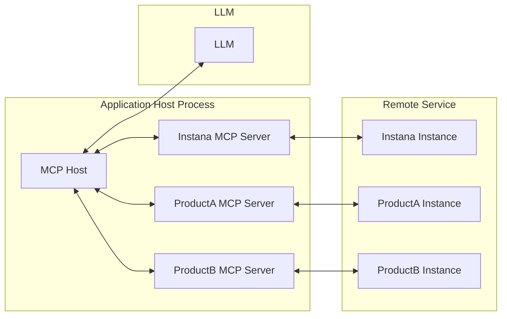
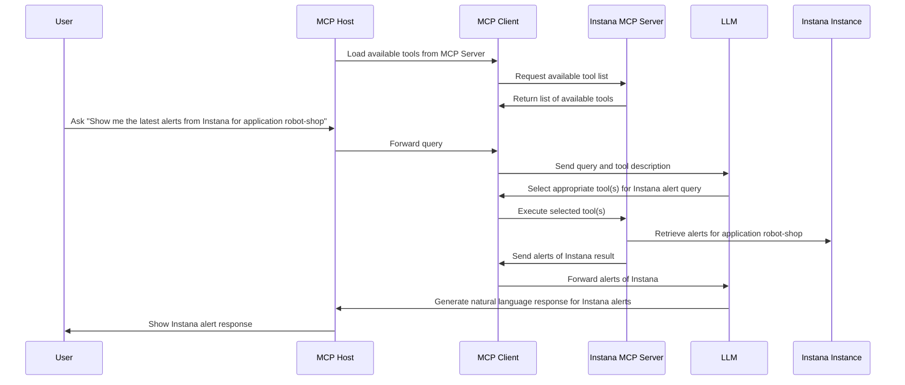

> 🔒 **SSL Enabled by Default**: Starting with this release 1.0.3, SSL certificate verification is **enabled by default** for all outgoing Instana API calls. You can customize this behaviour (disable, supply a custom CA bundle, etc.) via CLI flag, environment variable, or `config.yaml`. See [SSL Certificate Verification](#ssl-certificate-verification) for full details.

<!-- START doctoc generated TOC please keep comment here to allow auto update -->
<!-- DON'T EDIT THIS SECTION, INSTEAD RE-RUN doctoc TO UPDATE -->
## Table of Contents

- [MCP Server for IBM Instana](#mcp-server-for-ibm-instana)
  - [Quick Links](#quick-links)
  - [Architecture Overview](#architecture-overview)
  - [Workflow](#workflow)
  - [Prerequisites](#prerequisites)
  - [Installing Instana MCP server](#installing-instana-mcp-server)
    - [Option 1: Install from PyPI (Recommended)](#option-1-install-from-pypi-recommended)
    - [Option 2: Development Installation](#option-2-development-installation)
      - [Installing uv](#installing-uv)
      - [Setting Up the Environment](#setting-up-the-environment)
    - [Header-Based Authentication for Streamable HTTP Mode](#header-based-authentication-for-streamable-http-mode)
      - [1. API Token Authentication (Direct API Calls)](#1-api-token-authentication-direct-api-calls)
      - [2. Session Token Authentication (UI-Initiated Calls)](#2-session-token-authentication-ui-initiated-calls)
      - [3. JWT Token Authentication (IBM Platform Integration)](#3-jwt-token-authentication-ibm-platform-integration)
  - [Starting the Local MCP Server](#starting-the-local-mcp-server)
    - [Server Command Options](#server-command-options)
      - [Using the CLI (PyPI Installation)](#using-the-cli-pypi-installation)
      - [Using Development Installation](#using-development-installation)
    - [Starting in Streamable HTTP Mode](#starting-in-streamable-http-mode)
      - [Using CLI (PyPI Installation)](#using-cli-pypi-installation)
      - [Using Development Installation](#using-development-installation-1)
    - [Starting in Stdio Mode](#starting-in-stdio-mode)
      - [Using CLI (PyPI Installation)](#using-cli-pypi-installation-1)
      - [Using Development Installation](#using-development-installation-2)
    - [Tool Categories](#tool-categories)
      - [Using CLI (PyPI Installation)](#using-cli-pypi-installation-2)
      - [Using Development Installation](#using-development-installation-3)
    - [SSL Certificate Verification](#ssl-certificate-verification)
      - [Using the CLI option](#using-the-cli-option)
      - [Using the environment variable](#using-the-environment-variable)
      - [Using a custom CA bundle](#using-a-custom-ca-bundle)
    - [Catalog Response Caching](#catalog-response-caching)
      - [Cached catalog operations](#cached-catalog-operations)
      - [Configuring caching (stdio mode)](#configuring-caching-stdio-mode)
      - [Configuring caching (streamable-http mode)](#configuring-caching-streamable-http-mode)
      - [Using .bob/mcp.json (stdio mode)](#using-bobmcpjson-stdio-mode)
    - [Verifying Server Status](#verifying-server-status)
    - [Common Startup Issues](#common-startup-issues)
  - [Setup and Usage](#setup-and-usage)
    - [Supported MCP Clients](#supported-mcp-clients)
    - [Connecting to Multiple Instana MCP Servers](#connecting-to-multiple-instana-mcp-servers)
  - [Available Tools](#available-tools)
  - [Tool Filtering](#tool-filtering)
    - [Usage Examples](#usage-examples)
      - [Using CLI (PyPI Installation)](#using-cli-pypi-installation-3)
      - [Using Development Installation](#using-development-installation-4)
    - [Benefits of Tool Filtering](#benefits-of-tool-filtering)
  - [Docker Deployment](#docker-deployment)
    - [Building the Docker Image](#building-the-docker-image)
      - [**Prerequisites**](#prerequisites-1)
      - [**Build and Run**](#build-and-run)
  - [General Issues](#general-issues)

<!-- END doctoc generated TOC please keep comment here to allow auto update -->

# MCP Server for IBM Instana

## Quick Links

- **[Tools & Examples](docs/TOOLS_AND_EXAMPLES.md)** - Comprehensive tool documentation with real-world examples
- **[Privacy Policy](docs/PRIVACY.md)** - Data handling and privacy information
- **[Docker Deployment Guide](DOCKER.md)** - Comprehensive Docker deployment, multi-architecture builds, and production setup

---

The Instana MCP server enables seamless interaction with the Instana observability platform, allowing you to access real-time observability data directly within your development workflow.

It serves as a bridge between clients (such as AI agents or custom tools) and the Instana REST APIs, converting user queries into Instana API requests and formatting the responses into structured, easily consumable formats.

The server supports both **Streamable HTTP** and **Stdio** transport modes for maximum compatibility with different MCP clients. For more details, refer to the [MCP Transport Modes specification](https://modelcontextprotocol.io/specification/2025-06-18/basic/transports).

## Architecture Overview


```mermaid
graph LR
    subgraph "Application Host Process"
        MH[MCP Host]
        MSI[Instana MCP Server]
        MST[ProductA MCP Server]
        MSC[ProductB MCP Server]

        MH <--> MSI
        MH <--> MSC
        MH <--> MST
    end

    subgraph "Remote Service"
        II[Instana Instance]
        TI[ProductA Instance]
        CI[ProductB Instance]

        MSI <--> II
        MST <--> TI
        MSC <--> CI
    end

    subgraph "LLM"
        L[LLM]
        MH <--> L
    end
```

## Workflow

Consider a simple example: You're using an MCP Host (such as Claude Desktop, VS Code, or another client) connected to the Instana MCP Server. When you request information about Instana alerts, the following process occurs:

1. The MCP client retrieves the list of available tools from the Instana MCP server
2. Your query is sent to the LLM along with tool descriptions
3. The LLM analyzes the available tools and selects the appropriate one(s) for retrieving Instana alerts
4. The client executes the chosen tool(s) through the Instana MCP server
5. Results (latest alerts) are returned to the LLM
6. The LLM formulates a natural language response
7. The response is displayed to you


```mermaid
sequenceDiagram
    participant User
    participant ChatBot as MCP Host
    participant MCPClient as MCP Client
    participant MCPServer as Instana MCP Server
    participant LLM
    participant Instana as Instana Instance

    ChatBot->>MCPClient: Load available tools from MCP Server
    MCPClient->>MCPServer: Request available tool list
    MCPServer->>MCPClient: Return list of available tools
    User->>ChatBot: Ask "Show me the latest alerts from Instana for application robot-shop"
    ChatBot->>MCPClient: Forward query
    MCPClient->>LLM: Send query and tool description
    LLM->>MCPClient: Select appropriate tool(s) for Instana alert query
    MCPClient->>MCPServer: Execute selected tool(s)
    MCPServer->>Instana: Retrieve alerts for application robot-shop
    MCPServer->>MCPClient: Send alerts of Instana result
    MCPClient->>LLM: Forward alerts of Instana
    LLM->>ChatBot: Generate natural language response for Instana alerts
    ChatBot->>User: Show Instana alert response
```

## Prerequisites

- `python` - version 3.10 or higher
- `pip` - version 21.3 or higher (only required for pypi based installation)
- `uv` - version 0.11.6 or higher (only required for development installation)

## Installing Instana MCP server

### Option 1: Install from PyPI (Recommended)

The easiest way to use mcp-instana is to install it directly from PyPI:

```shell
pip install mcp-instana
```

After installation, you can run the server using the `mcp-instana` command directly.

### Option 2: Development Installation

For development or local customization, you can clone and set up the project locally.

#### Installing uv

This project uses `uv`, a fast Python package installer and resolver. To install `uv`, you have several options:

**Using pip:**
```shell
pip install uv
```

**Using Homebrew (macOS):**
```shell
brew install uv
```

For more installation options and detailed instructions, visit the [uv documentation](https://github.com/astral-sh/uv).

#### Setting Up the Environment

After installing `uv`, set up the project environment by running:

```shell
uv sync
```

### Header-Based Authentication for Streamable HTTP Mode

When using **Streamable HTTP mode**, you must pass Instana credentials via HTTP headers. This approach enhances security and flexibility by:

- Avoiding credential storage in environment variables
- Enabling the use of different credentials for different requests
- Supporting shared environments where environment variable modification is restricted
- Supporting both API token and session-based authentication

**Supported Authentication Modes:**

#### 1. API Token Authentication (Direct API Calls)
**Required Headers:**
- `instana-base-url`: Your Instana instance URL
- `instana-api-token`: Your Instana API token

**Example:**
```bash
--header "instana-base-url: https://your-instance.instana.io"
--header "instana-api-token: your-api-token"
```

#### 2. Session Token Authentication (UI-Initiated Calls)
**Required Headers:**
- `instana-base-url`: Your Instana instance URL
- `instana-auth-token`: Session authentication token from UI backend
- `instana-csrf-token`: CSRF token from UI backend
- `instana-cookie-name`: (Optional) Cookie name for session auth (default: `instanaAuthToken`)

**Example:**
```bash
--header "instana-base-url: https://your-instance.instana.io"
--header "instana-auth-token: your-session-token"
--header "instana-csrf-token: your-csrf-token"
--header "instana-cookie-name: in-token"
```

#### 3. JWT Token Authentication (IBM Platform Integration)
**Required Headers:**
- `instana-base-url`: Your Instana instance URL
- `instana-jwt-token`: JWT token from IBM Platform
- `instana-csrf-token`: CSRF token for request validation

**Example Configuration:**
```json
{
  "mcpServers": {
    "Instana MCP Server": {
      "command": "npx",
      "args": [
        "mcp-remote",
        "http://0.0.0.0:8080/mcp",
        "--allow-http",
        "--header",
        "instana-base-url: https://your-instana-instance.instana.io",
        "--header",
        "instana-jwt-token: your_jwt_token_here",
        "--header",
        "instana-csrf-token: your_csrf_token_here"
      ]
    }
  }
}
```

**Authentication Priority:**
1. **JWT Token** (if provided with CSRF token) - Takes precedence for IBM Platform integration
2. **Session Tokens** (if both auth_token and csrf_token provided)
3. **API Token** (if provided) - Standard authentication
4. **Environment Variable** (`INSTANA_API_TOKEN`) - Fallback

**Authentication Flow:**
1. HTTP headers must be present in each request
2. Server validates credentials based on priority order
3. Requests without valid authentication will fail

This design ensures secure credential transmission and supports multiple authentication flows including UI-initiated calls via WebSocket → Coordinator → MCP Server.

Ensure that the token used has the necessary permissions to invoke MCP tools. Check [here](docs/PERMISSIONS.md) for more information.

## Starting the Local MCP Server

Before configuring any MCP client (Claude Desktop, GitHub Copilot, or custom MCP clients), you need to start the local MCP server. The server supports two transport modes: **Streamable HTTP** and **Stdio**.

### Server Command Options

#### Using the CLI (PyPI Installation)

If you installed mcp-instana from PyPI, use the `mcp-instana` command:

```bash
mcp-instana [OPTIONS]
```

#### Using Development Installation

For local development, use the `uv run` command:

```bash
uv run src/core/server.py [OPTIONS]
```

**Available Options:**
- `--transport <mode>`: Transport mode (choices: `streamable-http`, `stdio`)
- `--env KEY=VALUE`: Set environment variable (can be repeated for multiple variables, e.g., `--env INSTANA_BASE_URL=https://... --env INSTANA_API_TOKEN=...`)
- `--debug`: Enable debug mode with additional logging
- `--log-level <level>`: Set the logging level (choices: `DEBUG`, `INFO`, `WARNING`, `ERROR`, `CRITICAL`)
- `--tools <categories>`: Comma-separated list of tool categories to enable (e.g., infra,app,events,website). Enabling a category will also enable its related prompts. For example: `--tools infra` enables the infra tools and all infra-related prompts.
- `--list-tools`: List all available tool categories and exit
- `--port <port>`: MCP server port (default: 8080, can be overridden with PORT env var)
- `--verify-ssl` [BOOL]`: Enable or disable SSL certificate verification for outgoing Instana API calls (default: `true`). Pass `false`/`0`/`no` to disable. Equivalent to setting `INSTANA_SSL_VERIFY=false`.
- `--help`: Show help message and exit

### Starting in Streamable HTTP Mode

**Streamable HTTP mode** provides a REST API interface and is recommended for most use cases.

#### Using CLI (PyPI Installation)

```bash
# Start with all tools enabled (default)
mcp-instana --transport streamable-http

# Start with debug logging
mcp-instana --transport streamable-http --debug

# Start with a specific log level
mcp-instana --transport streamable-http --log-level WARNING

# Start with specific tool categories only
mcp-instana --transport streamable-http --tools infra,events

# Combine options (specific log level, custom tools)
mcp-instana --transport streamable-http --log-level DEBUG --tools app,events
```

#### Using Development Installation

```bash
# Start with all tools enabled (default)
uv run src/core/server.py --transport streamable-http

# Start with debug logging
uv run src/core/server.py --transport streamable-http --debug

# Start with a specific log level
uv run src/core/server.py --transport streamable-http --log-level WARNING

# Start with specific tool and prompts categories only
uv run src/core/server.py --transport streamable-http --tools infra,events

# Start with custom port
uv run src/core/server.py --transport streamable-http --port 9000

# Combine options (specific log level, custom tools and prompts)
uv run src/core/server.py --transport streamable-http --log-level DEBUG --tools app,events
```

**Key Features of Streamable HTTP Mode:**
- Uses HTTP headers for authentication (no environment variables needed)
- Supports different credentials per request
- Better suited for shared environments
- MCP server default port: 8080
- MCP endpoint: `http://0.0.0.0:8080/mcp/`

### Starting in Stdio Mode

**Stdio mode** uses standard input/output for communication and requires environment variables for authentication.

#### Using CLI (PyPI Installation)

```bash
# Option 1: Set environment variables first
export INSTANA_BASE_URL="https://your-instana-instance.instana.io"
export INSTANA_API_TOKEN="your_instana_api_token"

# Start the server (stdio is the default if no transport specified)
mcp-instana

# Or explicitly specify stdio mode
mcp-instana --transport stdio

# Option 2: Pass the base url and api token directly 
mcp-instana --base-url https://your-instana-instance.instana.io --api-token your_instana_api_token

# Or with explicit stdio mode
mcp-instana --transport stdio --base-url https://your-instana-instance.instana.io --api-token your_instana_api_token
```

#### Using Development Installation

```bash
# Option 1: Set environment variables first
export INSTANA_BASE_URL="https://your-instana-instance.instana.io"
export INSTANA_API_TOKEN="your_instana_api_token"

# Start the server (stdio is the default if no transport specified)
uv run src/core/server.py

# Or explicitly specify stdio mode
uv run src/core/server.py --transport stdio

# Option 2: Pass the base url and api token directly 
uv run src/core/server.py --base-url https://your-instana-instance.instana.io --api-token your_instana_api_token

# Or with explicit stdio mode
uv run src/core/server.py --transport stdio --base-url https://your-instana-instance.instana.io --api-token your_instana_api_token
```

**Key Features of Stdio Mode:**
- Uses environment variables for authentication (can be set via `export` or `--env` flags)
- Direct communication via stdin/stdout
- Required for certain MCP client configurations
- The `--api-token` and `base-url` flags provides a convenient way to set credentials without modifying shell environment

### Tool Categories

You can optimize server performance by enabling only the tools and prompts categories you need:

#### Using CLI (PyPI Installation)

```bash
# List all available categories
mcp-instana --list-tools

# Enable specific categories
mcp-instana --transport streamable-http --tools infra,app
mcp-instana --transport streamable-http --tools events
```

#### Using Development Installation

```bash
# List all available categories
uv run src/core/server.py --list-tools

# Enable specific categories
uv run src/core/server.py --transport streamable-http --tools infra,app
uv run src/core/server.py --transport streamable-http --tools events
```

### SSL Certificate Verification

SSL certificate verification for outgoing Instana API calls is **enabled by default**. This applies to both **Streamable HTTP** and **Stdio** transport modes.

To disable SSL certificate verification (e.g. for environments with self-signed or internal certificates), use the `--verify-ssl` CLI option, the `INSTANA_SSL_VERIFY` environment variable, or the `sslVerify` key in `config.yaml`.

#### Using the CLI option

```bash
# Disable SSL verification
uv run src/core/server.py --verify-ssl false

# Explicitly enable (default behaviour, no flag needed)
uv run src/core/server.py --verify-ssl true
```

#### Using the environment variable

```bash
export INSTANA_SSL_VERIFY=false
uv run src/core/server.py
```

SSL verification is disabled when `INSTANA_SSL_VERIFY` is set to `0`, `false`, or `no` (case-insensitive). Any other value, or when the variable is unset, keeps verification **enabled**.

#### Using config.yaml (SaaS / Kubernetes deployments)

```yaml
# SSL verification for outbound API calls (default: true)
sslVerify: false
```
The `sslVerify` key is read by `start.sh` at startup and exported as `INSTANA_SSL_VERIFY`.

#### Using a custom CA bundle

When SSL verification is enabled, the system CA bundle is used by default. To use a custom CA certificate bundle, set `INSTANA_CA_BUNDLE`:

```bash
export INSTANA_SSL_VERIFY=true
export INSTANA_CA_BUNDLE=/path/to/ca-bundle.crt
uv run src/core/server.py
```

`INSTANA_CA_BUNDLE` is only used when SSL certificate verification is enabled.

> The server logs the effective SSL verification state at startup, so you can immediately confirm whether your environment variable, CLI flag, or config file setting was picked up.

## API Call Timeout

Every outgoing Instana API call is subject to a hard wall-clock timeout. If the Instana server does not respond within the deadline the call is cancelled and an error is returned immediately — no indefinitely hanging requests.

The default timeout is **180 seconds**. Override it with the `INSTANA_API_TIMEOUT` environment variable:

```bash
export INSTANA_API_TIMEOUT=60   # 60-second deadline
uv run src/core/server.py
```

`INSTANA_API_TIMEOUT` must be a positive integer (seconds). Non-integer or non-positive values are ignored and the 180-second default is used instead.

### Catalog Response Caching

The server caches catalog API responses (metrics, tags, and plugins) in-process to eliminate redundant round-trips. Catalog data is stable within a tenant — it only changes when new integrations are deployed — so responses are safe to reuse across the lifetime of a single server process.

**Default TTL: 30 minutes.** Each unique combination of tenant URL, method, and parameters gets its own independent cache slot. Error responses are never cached, so a transient network failure cannot poison the store.

#### Cached catalog operations

| Domain | Operation | Cache key discriminators |
|---|---|---|
| Application | Get metric catalog | — |
| Application | Get tag catalog | `use_case`, `data_source` |
| Website | Get metrics catalog | — |
| Website | Get tag catalog | `beacon_type`, `use_case` |
| Mobile App | Get metric catalog | — |
| Mobile App | Get tag catalog | `beacon_type`, `use_case` |
| Synthetic | Get metrics catalog | — |
| Synthetic | Get tag catalog | `use_case` |
| Infrastructure | Get metrics catalog | `plugin`, `filter` |
| Infrastructure | Get tag catalog | `plugin` |

#### Configuring caching (stdio mode)

Set environment variables before starting the server. In stdio mode these are the only values used — no restart is required when using Bob, as the server reboots automatically.

```bash
# Disable caching entirely
export INSTANA_CACHE_ENABLED=false
# Override TTL to 5 minutes (default: 1800)
export INSTANA_CACHE_TTL=300
```

`INSTANA_CACHE_ENABLED` is treated as disabled when set to `false`, `0`, or `no` (case-insensitive). Any other value keeps caching **enabled**.

#### Configuring caching (streamable-http mode)

In addition to the environment variables above, every HTTP request can override the cache settings via headers. Per-request headers take precedence over the process-level defaults, so caching can be toggled on or off without restarting the server.

```
instana-cache-enabled: false
instana-cache-ttl: 300
```
To set cache headers persistently in your MCP client config (e.g. `.bob/mcp.json` for streamable-http mode), add them alongside the existing Instana headers:
```json
{
  "mcpServers": {
    "Instana MCP Server": {
      "url": "http://localhost:8080/mcp",
      "headers": {
        "instana-base-url": "https://your-instana-instance.example.com",
        "instana-api-token": "YOUR_API_TOKEN",
        "instana-cache-enabled": "true",
        "instana-cache-ttl": "1800"
      }
    }
  }
}
```

To disable caching for a specific client connection:

```json
{
  "mcpServers": {
    "Instana MCP Server": {
      "url": "http://localhost:8080/mcp",
      "headers": {
        "instana-base-url": "https://your-instana-instance.example.com",
        "instana-api-token": "YOUR_API_TOKEN",
        "instana-cache-enabled": "false"
      }
    }
  }
}
```

#### Using .bob/mcp.json (stdio mode)

To set cache configuration persistently for Bob, add the env vars to the `env` block in `.bob/mcp.json`:

```json
{
  "mcpServers": {
    "instana": {
      "env": {
        "INSTANA_CACHE_ENABLED": "true",
        "INSTANA_CACHE_TTL": "1800"
      }
    }
  }
}
```

> The server logs the effective cache state at DEBUG level on every catalog call, showing whether a response was a cache HIT or MISS.

### Verifying Server Status

Once started, you can verify the server is running:

**For Streamable HTTP mode:**
```bash
# Check MCP server
curl http://0.0.0.0:8080/mcp/

# Or with custom port
curl http://0.0.0.0:9000/mcp/
```

**For Stdio mode:**
The server will start and wait for stdin input from MCP clients.

### Common Startup Issues

**SSL / Certificate Issues:**
See the [SSL Certificate Verification](#ssl-certificate-verification) section above for configuration options. If you encounter SSL errors with verification enabled and are using macOS, ensure your Python environment has access to system certificates:

```bash
# macOS - Install certificates for Python
/Applications/Python\ 3.13/Install\ Certificates.command
```

**Port Already in Use:**
If port 8080 is already in use, specify a different port:
```bash
uv run src/core/server.py --transport streamable-http --port 9000
```

**Missing Dependencies:**
Ensure all dependencies are installed:
```bash
uv sync
```

## Setup and Usage

### Supported MCP Clients

| Client | Transports |
| :--- | :--- |
| [Bob IDE](./docs/mcp-clients/bob-ide.md)| `streamable http`, `stdio` | 
| [Bob CLI](./docs/mcp-clients/bob-cli.md) | `streamable http`, `stdio` |
| [Claude Desktop](./docs/mcp-clients/claude-desktop.md) |  `streamable http`, `stdio` | 
| [Kiro IDE](./docs/mcp-clients/kiro-ide.md)| `streamable http`, `stdio` |
| [Kiro CLI](./docs/mcp-clients/kiro-cli.md)| `streamable http`, `stdio` |  
| [Github Copilot](./docs/mcp-clients/github-copilot.md) | `streamable http`, `stdio` | 
| [Mistral AI](./docs/mcp-clients/mistral-ai.md) | `streamable http` |

### Connecting to Multiple Instana MCP Servers

You can configure your MCP client to connect to multiple instances. Below is a sample configuration:

```json
{
  "mcpServers": {
    "Instana MCP Server1": {
      "command": "npx",
      "args": [
        "mcp-remote",
        "http://0.0.0.0:8080/mcp/",
        "--allow-http",
        "--header",
        "instana-base-url: ENV1_INSTANA_URL",
        "--header",
        "instana-api-token: ENV1_INSTANA_API_TOKEN"
      ]
    },
    "Instana MCP Server2": {
      "command": "npx",
      "args": [
        "mcp-remote",
        "http://0.0.0.0:8080/mcp/",
        "--allow-http",
        "--header",
        "instana-base-url: ENV2_INSTANA_URL",
        "--header",
        "instana-api-token: ENV2_INSTANA_API_TOKEN"
      ]
    }
  }
}
```

To target a specific server, ensure that:
- The server is configured with the appropriate environment name in the MCP configuration (e.g. Instana MCP Server1)
- The prompt explicitly mentions the server/environment name.

The request will then be routed to the corresponding configured server. If no server/environment is explicitly mentioned in the prompt, MCP uses the first server defined in the configuration as the default server.

Note: If the requested server is down or unreachable, MCP behaves as expected and forwards the API failure. The user will receive the corresponding error returned by the API, indicating that the server is unavailable. MCP relies on the underlying API availability and does not perform automatic failover.

## Available Tools

| Tool                                                          | Category                       | Description                                            |
|---------------------------------------------------------------|--------------------------------|------------------------------------------------------- |
| `manage_applications`                                         | Application & Infrastructure   | Unified tool for managing application metrics, alert configs, settings, and catalog |
| `manage_websites`                                             | Website Monitoring             | Unified smart router for website analyze, catalog, configuration, and advanced config operations |
| `manage_custom_dashboards`                                    | Custom Dashboards              | Unified tool for managing custom dashboard CRUD operations |
| `manage_infrastructure`                                       | Infrastructure                 | Unified smart router for infrastructure analyze, catalog (`get_plugin_schema`), smart alert configurations and snapshot resource operations |
| `manage_automation`                                           | Automation                     | Unified smart router for automation: browse action catalog and view execution history |
| `manage_events`                                               | Events                         | Unified smart router for events monitoring: get event by ID, get events by IDs, Kubernetes events, agent monitoring events and all events |
| `manage_slo`                                                  | SLO Management                 | Unified smart router for SLO configurations, reports, alerts, and correction windows with intelligent timezone handling |
| `manage_releases`                                             | Release Management             | Unified smart router for release tracking: list releases with pagination and name filtering, get release details, create/update/delete releases with timezone support |
| `manage_maintenance_windows`                                  | Maintenance Windows            | Unified smart router for maintenance window lifecycle management: create, modify, close, and list maintenance windows with template support and ServiceNow integration |
| `manage_mobile_apps`                                          | Mobile App Monitoring          | Unified smart router for mobile app monitoring: analyze beacons, performance metrics, session replay, configuration, and alert management |
| `manage_synthetics`                                           | Synthetic Monitoring           | Unified smart router for synthetic monitoring: catalog, metrics, settings (read-only), and test playback results |

**For detailed tool documentation, capabilities, and technical reference, see [Tools & Examples](docs/TOOLS_AND_EXAMPLES.md)**

## Tool Filtering

The MCP server supports selective tool loading to optimize performance and reduce resource usage. You can enable only the tool categories you need for your specific use case.

### Usage Examples

#### Using CLI (PyPI Installation)

```bash
# Enable only application monitoring tools
mcp-instana --tools app --transport streamable-http

# Enable only infrastructure analysis tools
mcp-instana --tools infra --transport streamable-http

# Enable application and infrastructure tools
mcp-instana --tools app,infra --transport streamable-http

# Enable events and website tools
mcp-instana --tools events,website --transport streamable-http

# Enable settings (custom dashboards) and app tools
mcp-instana --tools settings,app --transport streamable-http

# Enable releases and events tools
mcp-instana --tools releases,events --transport streamable-http

# Enable maintenance window and events tools
mcp-instana --tools maintenance,events --transport streamable-http

# Enable automation and app tools
mcp-instana --tools automation,app --transport streamable-http

# Enable SLO management tools
mcp-instana --tools slo --transport streamable-http

# Enable synthetic monitoring tools
mcp-instana --tools synthetic --transport streamable-http

# Enable mobile app monitoring tools
mcp-instana --tools mobile_app --transport streamable-http

# Enable all tools (default behavior)
mcp-instana --transport streamable-http

# List all available tool categories and their tools
mcp-instana --list-tools
```

#### Using Development Installation

```bash
# Enable only application monitoring tools
uv run src/core/server.py --tools app --transport streamable-http

# Enable only infrastructure analysis tools
uv run src/core/server.py --tools infra --transport streamable-http

# Enable application and infrastructure tools
uv run src/core/server.py --tools app,infra --transport streamable-http

# Enable events and website tools
uv run src/core/server.py --tools events,website --transport streamable-http

# Enable settings (custom dashboards) and app tools
uv run src/core/server.py --tools settings,app --transport streamable-http

# Enable releases and events tools
uv run src/core/server.py --tools releases,events --transport streamable-http

# Enable maintenance window and events tools
uv run src/core/server.py --tools maintenance,events --transport streamable-http

# Enable automation and app tools
uv run src/core/server.py --tools automation,app --transport streamable-http

# Enable SLO management tools
uv run src/core/server.py --tools slo --transport streamable-http

# Enable synthetic monitoring tools
uv run src/core/server.py --tools synthetic --transport streamable-http

# Enable mobile app monitoring tools
uv run src/core/server.py --tools mobile_app --transport streamable-http

# Enable all tools (default behavior)
uv run src/core/server.py --transport streamable-http

# List all available tool categories and their tools
uv run src/core/server.py --list-tools
```

### Benefits of Tool Filtering

- **Performance**: Reduced startup time and memory usage
- **Security**: Limit exposure to only necessary APIs
- **Clarity**: Focus on specific use cases (e.g., only infrastructure monitoring)
- **Resource Efficiency**: Lower CPU and network usage

**For usage examples and prompts, see [Example Prompts](docs/TOOLS_AND_EXAMPLES.md)**

## Docker Deployment

The MCP Instana server can be deployed using Docker for production environments. The Docker setup is optimized for security, performance, and minimal resource usage.

### Building the Docker Image

#### **Prerequisites**
- Docker installed and running
- Access to the project source code

#### **Build and Run**
```bash
# Ensure you are in the mcp-instana directory of your repo
# Build the optimized production image
docker build -t mcp-instana:latest .
```

The above command would build the image using the instructions in the `Dockerfile`. The default port is `8080` and transport mode is `streamable-http`

```bash
# Run the container (credentials are supplied via HTTP headers at request time)
docker run -p 8080:8080 mcp-instana
```

If you want to use a custom port on your host (ex: 9000)

```bash
# Run with a custom host port
docker run -p 9000:8080 mcp-instana
```

### Connecting to mcp-instana container in streamable mode

Assuming your started your container using the command: `docker run -p 8080:8080 mcp-instana`

Your MCP Client would connect to the Host port (8080). By default, the container runs in streamable mode.

Here is a sample configuration for your MCP client:

```
{
  "mcpServers": {
    "Instana MCP Server": {
      "command": "npx",
      "args": [
        "mcp-remote",
        "http://localhost:8080/mcp",
        "--allow-http",
        "--header",
        "instana-base-url: https://your-instana-instance.instana.io",
        "--header",
            "instana-api-token: your_instana_api_token"
      ]
    }
  }
}
```

### Connecting to mcp-instana in stdio mode

In stdio mode, you can have your MCP Client to start and connect to the container. Here you are explicitly specifying to run in `stdio` by providing a value for the `--transport` flag.

Below is a sample configuration:

```
{
  "mcpServers": {
    "Instana MCP Server": {
      "command": "docker",
      "args": [
        "run", "-i", "--rm",
        "-e", "INSTANA_API_TOKEN=your_instana_api_token",
        "-e", "INSTANA_BASE_URL=https://your-instana-instance.instana.io",
        "mcp-instana",
        "--transport", "stdio"
      ]
    }
  }
}
```

For more details, check the Docker deployment guide [here](/DOCKER.md)


**For comprehensive Docker documentation including multi-architecture builds, `.dockerignore`, security best practices, and production deployment examples, see [DOCKER.md](DOCKER.md).**

## **General Issues**

- **GitHub Copilot**
  - If you encounter issues with GitHub Copilot, try starting/stopping/restarting the server in the `mcp.json` file and keep only one server running at a time.

- **Certificate Issues** 
  - If you encounter certificate issues, such as `[SSL: CERTIFICATE_VERIFY_FAILED] certificate verify failed: unable to get local issuer certificate`: 
    - Check that you can reach the Instana API endpoint using `curl` or `wget` with SSL verification. 
      - If that works, your Python environment may not be able to verify the certificate and might not have access to the same certificates as your shell or system. Ensure your Python environment uses system certificates (macOS). You can do this by installing certificates to Python:
      `/Applications/Python\ 3.13/Install\ Certificates.command`
    - If you cannot reach the endpoint with SSL verification, try without it. If that works, check your system's CA certificates and ensure they are up-to-date.