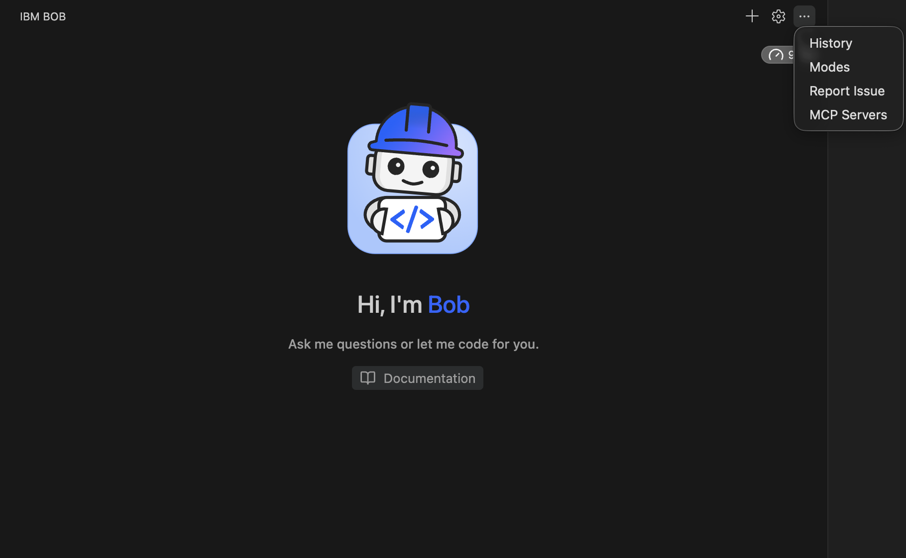
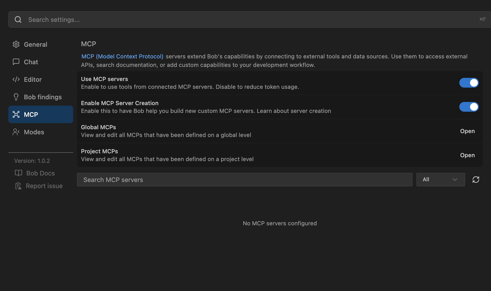
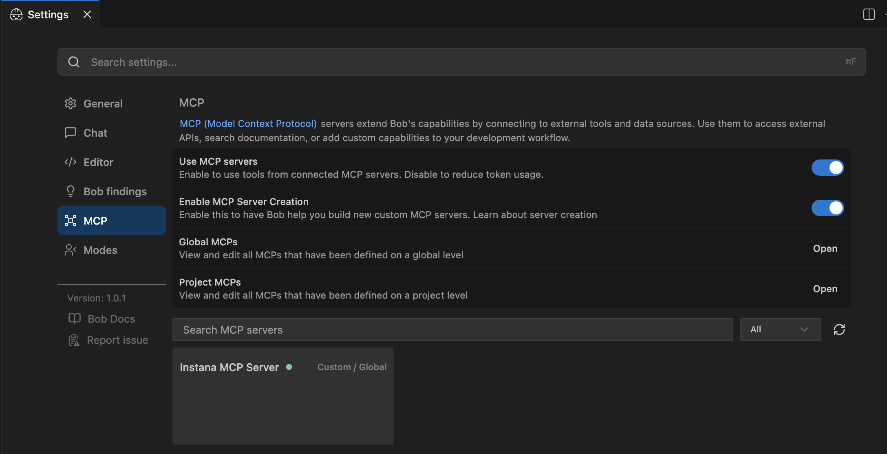
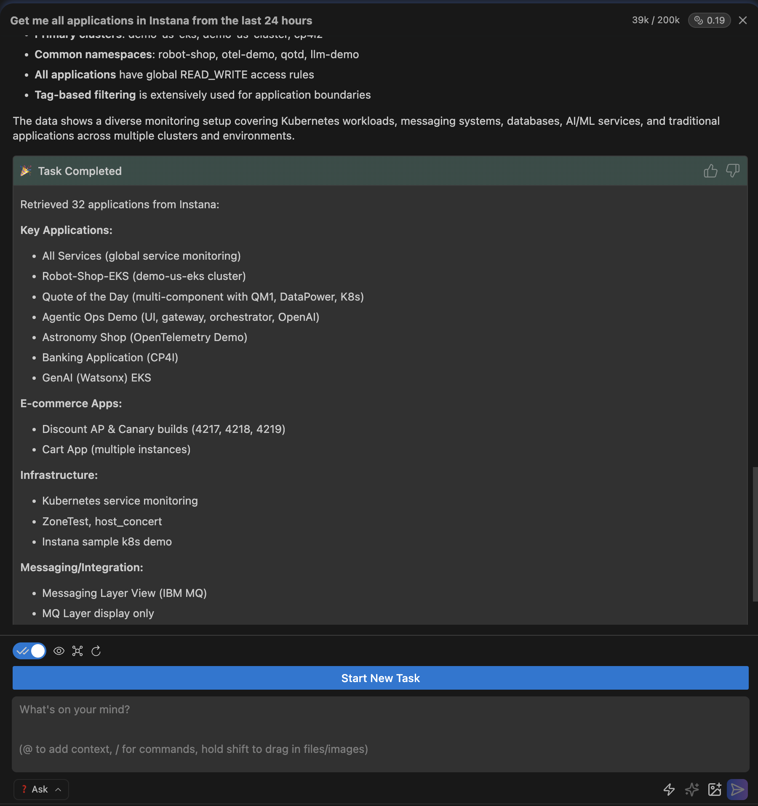

## Bob IDE

Bob is IBM's AI-powered IDE that natively supports MCP integration. Bob provides a seamless development experience with built-in AI assistance and observability tools.

### Streamable HTTP Mode

The Streamable HTTP mode provides a REST API interface for MCP communication using JSON-RPC over HTTP.

**Step 1: Start the MCP Server in Streamable HTTP Mode**

Before configuring Bob IDE, you need to start the MCP server in Streamable HTTP mode. Please refer to the [Starting the Local MCP Server](../../README.md#starting-the-local-mcp-server) section for detailed instructions.

**Step 2: Configure Bob IDE**

In the top right corner of the Bob panel, you will see a dropdown with MCP servers:



Select this dropdown to configure MCP at either the project level or the global level.



#### MCP Configuration Scopes

Bob supports two levels of MCP configuration, allowing you to choose the scope that best fits your use case:

1. Global Configuration (User-Level)

Global configuration applies MCP servers across all projects for the current user. This is ideal when you want the same MCP servers available in every project you work on.

File Locations:

- macOS: `~/Library/Application Support/Bob/bob_config.json`
- Windows: `%APPDATA%\Bob\bob_config.json`
- Linux: `~/.config/Bob/bob_config.json`

2. Project Configuration (Project-Level)

Project configuration applies MCP servers only to a specific project. This is useful when different projects require different MCP server configurations or when you want to share MCP settings with your team via version control.

File Location:

- `.bob/bob_config.json` in your project root directory

Choosing Between Global and Project Configuration:

- Use global configuration for MCP servers you want available across all your projects
- Use project configuration for project-specific MCP servers or to share configurations with your team
- Both configurations can coexist - project-level settings take precedence over global settings for the same server name

For more information about Bob and MCP configuration, visit: https://bob.ibm.com/docs/ide/configuration/mcp/mcp-in-bob

**Local Configuration:**

Configure Bob IDE to pass Instana credentials via headers:

```
{
  "mcpServers": {
    "Instana MCP Server": {
      "command": "npx",
      "args": [
        "mcp-remote", "http://0.0.0.0:8080/mcp/",
        "--allow-http",
        "--header", "instana-base-url: https://your-instana-instance.instana.io",
        "--header", "instana-api-token: your_instana_api_token"
      ]
    }
  }
}
```

**Remote Configuration:**

Configure Bob to connect to a remote Instana MCP server (e.g., deployed on IBM Code Engine):

```
{
  "mcpServers": {
    "Instana MCP Server": {
      "command": "npx",
      "args": [
        "mcp-remote", "https://app-instana-750.1zetetanw8ul.us-east.codeengine.appdomain.cloud/mcp/",
        "--allow-http",
        "--header", "instana-base-url: https://your-instana-instance.instana.io",
        "--header", "instana-api-token: your_instana_api_token"
      ]
    }
  }
}
```

**Note:** To use npx, we recommend first installing NVM (Node Version Manager), then using it to install Node.js.
Installation instructions are available at: https://nodejs.org/en/download

**Step 3: Test the Connection**

Once you set up the MCP configuration, the newly configured MCP server should appear as enabled. A green dot indicates that the server is running successfully.




You can now run queries in Bob IDE:

```
get me all applications from Instana in the last 24 hours
```


### Stdio Mode

**Configuration using CLI (PyPI Installation - Recommended):**

**Option 1: Using environment variables in config:**
```json
{
  "mcpServers": {
    "Instana MCP Server": {
      "command": "mcp-instana",
      "args": ["--transport", "stdio"],
      "env": {
        "INSTANA_BASE_URL": "https://your-instana-instance.instana.io",
        "INSTANA_API_TOKEN": "your_instana_api_token"
      }
    }
  }
}
```

**Option 2: Using --env flag (alternative method):**
```json
{
  "mcpServers": {
    "Instana MCP Server": {
      "command": "mcp-instana",
      "args": [
        "--transport", "stdio",
        "--env", "INSTANA_BASE_URL=https://your-instana-instance.instana.io",
        "--env", "INSTANA_API_TOKEN=your_instana_api_token"
      ]
    }
  }
}
```

**Note:** If you encounter "command not found" errors, use the full path to mcp-instana. Find it with `which mcp-instana` and use that path instead.

**Configuration using Development Installation:**

**Option 1: Using environment variables in config:**
```json
{
  "mcpServers": {
    "Instana MCP Server": {
      "command": "uv",
      "args": [
        "--directory",
        "<path-to-mcp-instana-folder>",
        "run",
        "src/core/server.py"
      ],
      "env": {
        "INSTANA_BASE_URL": "https://your-instana-instance.instana.io",
        "INSTANA_API_TOKEN": "your_instana_api_token"
      }
    }
  }
}
```

**Option 2: Using --env flag (alternative method):**
```json
{
  "mcpServers": {
    "Instana MCP Server": {
      "command": "uv",
      "args": [
        "--directory",
        "<path-to-mcp-instana-folder>",
        "run",
        "src/core/server.py",
        "--env", "INSTANA_BASE_URL=https://your-instana-instance.instana.io",
        "--env", "INSTANA_API_TOKEN=your_instana_api_token"
      ]
    }
  }
}
```
